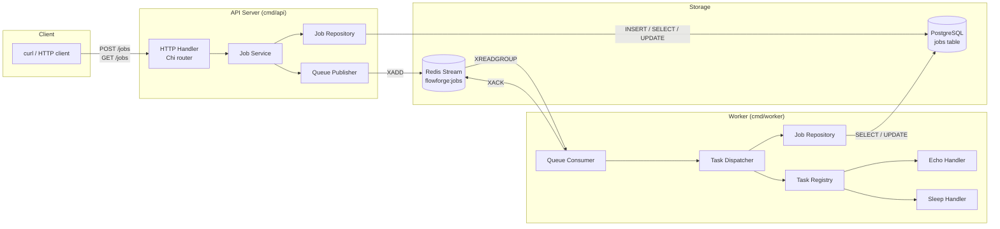
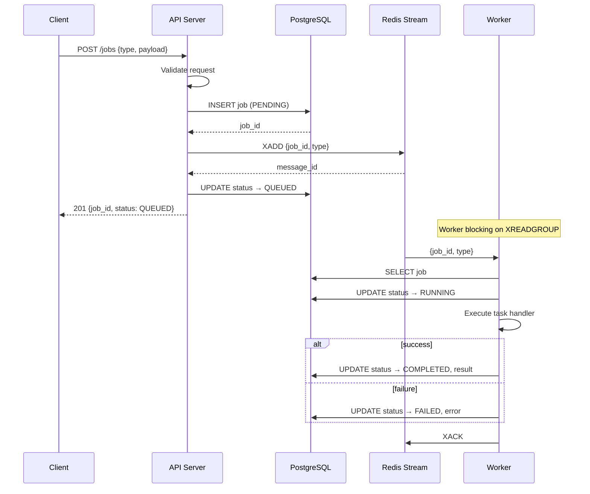
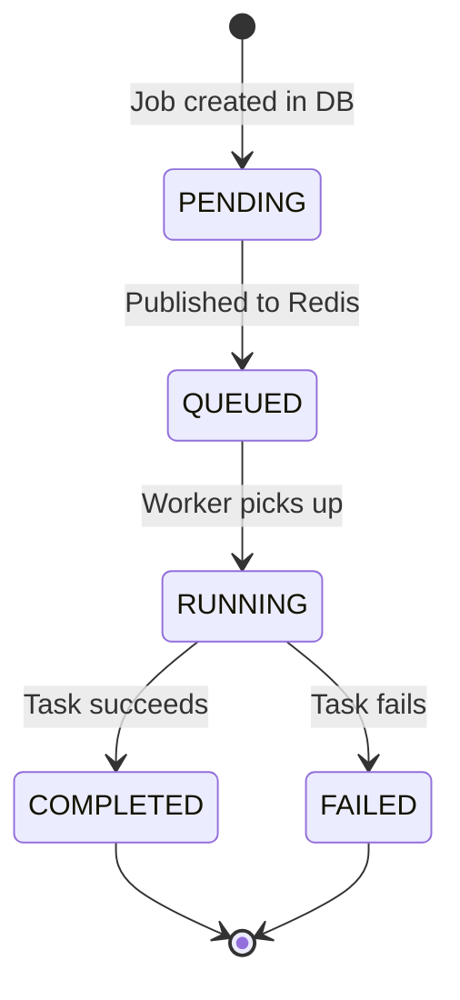
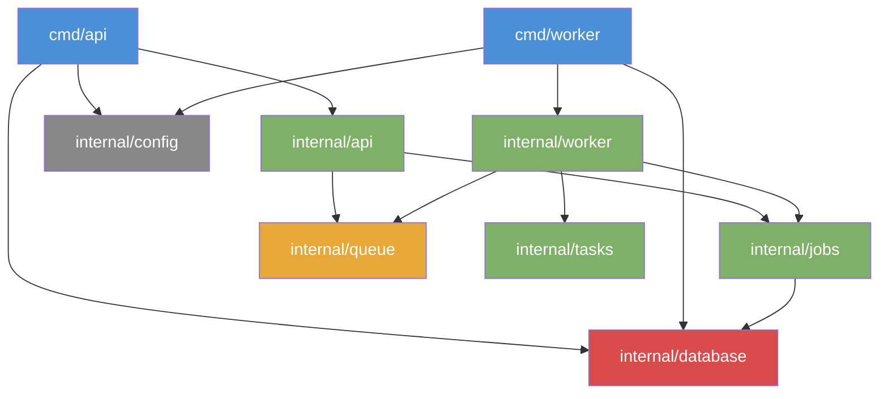
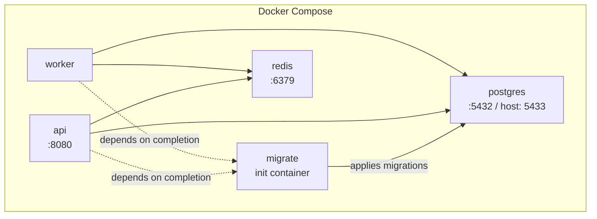

# Stage 1 Architecture

## System Overview

## Request Flow — Job Creation

## Job State Machine

## Package Dependency Graph

## Infrastructure

## Key Design Decisions

1. **PostgreSQL is the source of truth** — Redis holds queue pointers only. See [ADR-001](../adr/001-postgresql-source-of-truth.md).
2. **Redis Streams for queueing** — lightweight, consumer-group-ready with bounded retention (`MaxLen: 10000, Approx: true`). See [ADR-002](../adr/002-redis-streams-queue.md).
3. **Queue abstraction** — `internal/queue` defines `Publisher` and `Consumer` interfaces. Redis is the current implementation; Kafka can be swapped in later.
4. **Task registry** — handlers register by name; the worker dispatches by job type. New task types require only a new handler + registration.
5. **Decoupled Readiness Probes** — `/readyz` utilizes the abstract `Pinger` interface for PostgreSQL and Redis health checks without exposing internal drivers.
6. **Worker Resilience & Panic Recovery** — Worker recovers from task panics via `recover()`, marking jobs `FAILED` with sanitized error messages and acknowledging queue messages to prevent blocking. Graceful shutdown uses an isolated 5-second context to finalize job status and queue ACKs.
7. **Goose migrations** — SQL-based, no ORM, version-controlled schema changes applied via a dedicated migration runner.
8. **Chi router** — lightweight, idiomatic, stdlib-compatible middleware chain.
