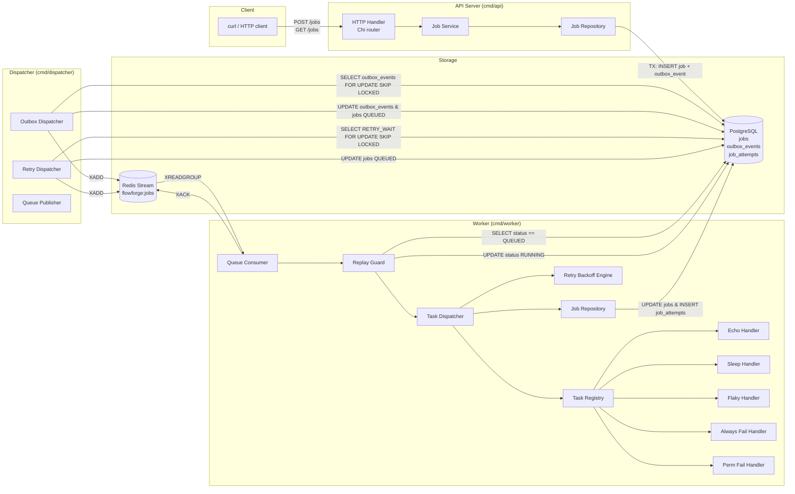
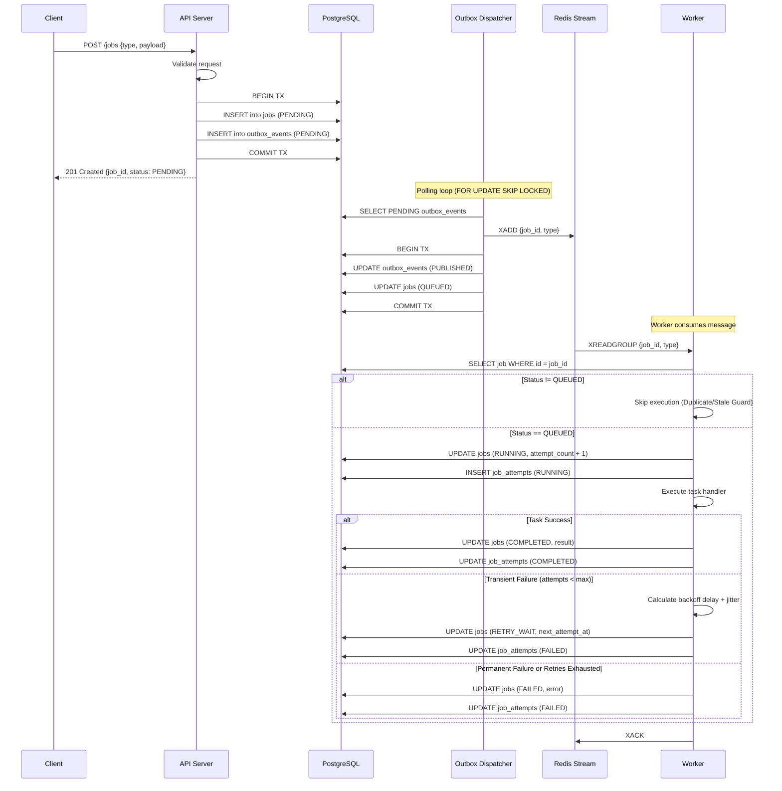
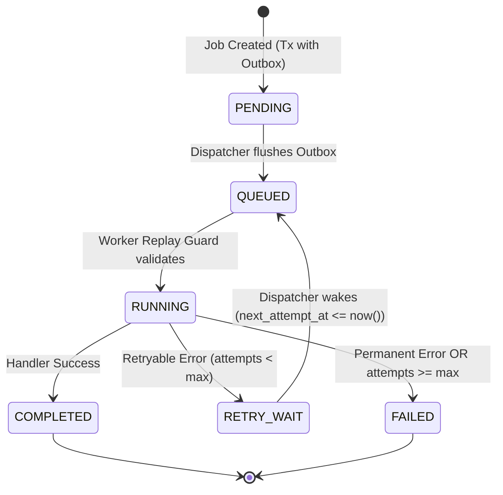
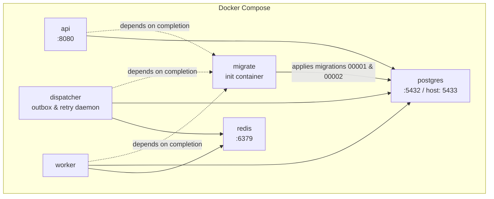

# Stage 2 Architecture

## System Overview

```mermaid
graph LR
    subgraph Client
        C[curl / HTTP client]
    end

    subgraph API["API Server (cmd/api)"]
        H[HTTP Handler<br/>Chi router]
        S[Job Service]
        R[Job Repository]
    end

    subgraph Storage
        PG[(PostgreSQL<br/>jobs<br/>outbox_events<br/>job_attempts)]
        RS[(Redis Stream<br/>flowforge:jobs)]
    end

    subgraph Dispatcher["Dispatcher (cmd/dispatcher)"]
        OD[Outbox Dispatcher]
        RD[Retry Dispatcher]
        DP[Queue Publisher]
    end

    subgraph Worker["Worker (cmd/worker)"]
        QC[Queue Consumer]
        RG[Replay Guard]
        D[Task Dispatcher]
        TR[Task Registry]
        TH1[Echo Handler]
        TH2[Sleep Handler]
        TH3[Flaky Handler]
        TH4[Always Fail Handler]
        TH5[Perm Fail Handler]
        WR[Job Repository]
        BE[Retry Backoff Engine]
    end

    C -->|POST /jobs<br/>GET /jobs| H
    H --> S
    S --> R
    R -->|TX: INSERT job + outbox_event| PG

    OD -->|SELECT outbox_events FOR UPDATE SKIP LOCKED| PG
    OD -->|XADD| RS
    OD -->|UPDATE outbox_events & jobs QUEUED| PG

    RD -->|SELECT RETRY_WAIT FOR UPDATE SKIP LOCKED| PG
    RD -->|XADD| RS
    RD -->|UPDATE jobs QUEUED| PG

    RS -->|XREADGROUP| QC
    QC --> RG
    RG -->|SELECT status == QUEUED| PG
    RG -->|UPDATE status RUNNING| PG
    RG --> D
    D --> TR
    TR --> TH1
    TR --> TH2
    TR --> TH3
    TR --> TH4
    TR --> TH5
    D --> BE
    D --> WR
    WR -->|UPDATE jobs & INSERT job_attempts| PG
    QC -->|XACK| RS
```

## Request Flow — Transactional Outbox Ingestion

```mermaid
sequenceDiagram
    participant C as Client
    participant A as API Server
    participant PG as PostgreSQL
    participant D as Outbox Dispatcher
    participant RD as Redis Stream
    participant W as Worker

    C->>A: POST /jobs {type, payload}
    A->>A: Validate request
    A->>PG: BEGIN TX
    A->>PG: INSERT into jobs (PENDING)
    A->>PG: INSERT into outbox_events (PENDING)
    A->>PG: COMMIT TX
    A-->>C: 201 Created {job_id, status: PENDING}

    Note over D: Polling loop (FOR UPDATE SKIP LOCKED)
    D->>PG: SELECT PENDING outbox_events
    D->>RD: XADD {job_id, type}
    D->>PG: BEGIN TX
    D->>PG: UPDATE outbox_events (PUBLISHED)
    D->>PG: UPDATE jobs (QUEUED)
    D->>PG: COMMIT TX

    Note over W: Worker consumes message
    RD->>W: XREADGROUP {job_id, type}
    W->>PG: SELECT job WHERE id = job_id
    alt Status != QUEUED
        W->>W: Skip execution (Duplicate/Stale Guard)
    else Status == QUEUED
        W->>PG: UPDATE jobs (RUNNING, attempt_count + 1)
        W->>PG: INSERT job_attempts (RUNNING)
        W->>W: Execute task handler
        alt Task Success
            W->>PG: UPDATE jobs (COMPLETED, result)
            W->>PG: UPDATE job_attempts (COMPLETED)
        else Transient Failure (attempts < max)
            W->>W: Calculate backoff delay + jitter
            W->>PG: UPDATE jobs (RETRY_WAIT, next_attempt_at)
            W->>PG: UPDATE job_attempts (FAILED)
        else Permanent Failure or Retries Exhausted
            W->>PG: UPDATE jobs (FAILED, error)
            W->>PG: UPDATE job_attempts (FAILED)
        end
    end
    W->>RD: XACK
```

## Retry State Lifecycle

```mermaid
stateDiagram-v2
    [*] --> PENDING: Job Created (Tx with Outbox)
    PENDING --> QUEUED: Dispatcher flushes Outbox
    QUEUED --> RUNNING: Worker Replay Guard validates
    RUNNING --> COMPLETED: Handler Success
    RUNNING --> RETRY_WAIT: Retryable Error (attempts < max)
    RUNNING --> FAILED: Permanent Error OR attempts >= max
    RETRY_WAIT --> QUEUED: Dispatcher wakes (next_attempt_at <= now())
    COMPLETED --> [*]
    FAILED --> [*]
```

## Infrastructure

```mermaid
graph TB
    subgraph Docker Compose
        MIGRATE_C[migrate<br/>init container]
        API_C[api<br/>:8080]
        DISPATCHER_C[dispatcher<br/>outbox & retry daemon]
        WORKER_C[worker]
        PG_C[postgres<br/>:5432 / host: 5433]
        REDIS_C[redis<br/>:6379]
    end

    MIGRATE_C -->|applies migrations 00001 & 00002| PG_C
    API_C -.->|depends on completion| MIGRATE_C
    DISPATCHER_C -.->|depends on completion| MIGRATE_C
    WORKER_C -.->|depends on completion| MIGRATE_C
    API_C --> PG_C
    DISPATCHER_C --> PG_C
    DISPATCHER_C --> REDIS_C
    WORKER_C --> PG_C
    WORKER_C --> REDIS_C
```
